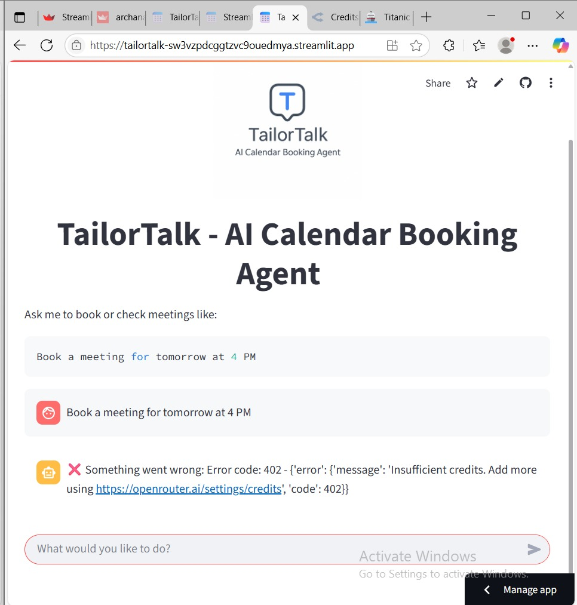

TailorTalk – AI Calendar Booking Agent

TailorTalk is a conversational AI agent that books appointments directly into your Google Calendar. Users can simply type messages like “Book a meeting tomorrow at 4 PM” and the agent handles the rest.

Built using LangChain, Streamlit, and the Google Calendar API, it also uses OpenRouter’s free LLMs like `mistralai/mistral-7b-instruct`.
 Features

- ✅ Book meetings in your Google Calendar
- 📆 Check availability before booking
- 🔐 OAuth2-based secure calendar access
- 💬 Natural language via OpenRouter LLM
- ⚠️ Handles invalid/past/multiple meeting requests
- 🧪 Test script to validate meeting booking independently

 How It Works

Example prompts:
Book a meeting for tomorrow at 4 PM
Am I free Friday between 3 and 5 PM?

The AI checks your calendar and responds accordingly — if credits are available.

---

 Note:

Agent integration with Google Calendar is complete.  
Due to LLM credit limits on OpenRouter, automated replies are currently unavailable.

A fallback script (`gcalendar/test_calendar.py`) confirms full booking functionality.

---
Screenshots
App UI with Logo

OpenRouter API Limit Error

Agent integration with Google Calendar is complete.
(frontend/test_calendar.py.jpg)

Something went wrong: Error code: 402 - {'error': {'message': 'Insufficient credits. Add more using https://openrouter.ai/settings/credits', 'code': 402}}
